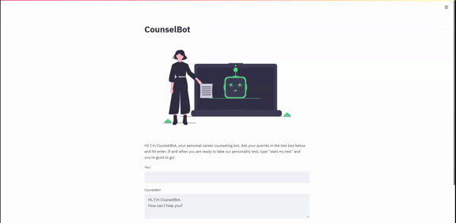
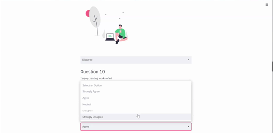

# :wave: Welcome to iGUIDER
 
 

iGUIDER is a web-based application that helps students make effective decisions involving their careers. 
It is an intuitive yet powerful tool built on a user-friendly platform to make the overall student experience smoother. 

## :mortar_board: Use iGUIDER to:
- Get answers to questions related to choice of streams and colleges.
- Take an in-depth quiz to find out more about yourself and your prospective career paths.
- Get a detailed report of the top 5 careers you have an inclination towards.

iGUIDER is a multi-platform web application that runs on Windows, Linux, Mac and Android. It is an easily moldable and largely scalable application designed to have a small memory footprint. 
This is the open-source repository for the iGUIDER web-app.

## :star2: Features
- A chatbot at the outset, running on a simple yet robust Tensorflow model, that:
  - Attends to questions regarding choice of careers, streams, subjects, and colleges.
  - Starts the personality test upon your request.
- The personality test, which is an in-depth quiz that analyses your strengths and weaknesses. 
- A detailed report following the quiz with particulars on the top 5 recommended career paths.
- Contacts of professional counselors and experts from various fields if seeking further guidance is deemed necessary. 

# :green_book: Steps for usage

- Clone the repository: 

        git clone https://github.com/jayxdev/iGUIDER.git
- Enter The directory: 

        cd iGUIDER
- Set up the Python environment with dependencies:

        pip install -r requirements.txt
- Run the Python setup:
        
        python setup.py
- Run the app:

        streamlit run Home.py
- Terminate the program from the terminal:

        Ctrl+C

That's it!
